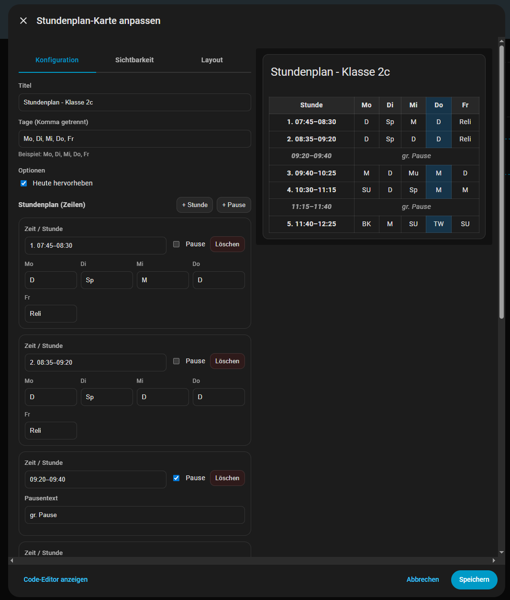

<<<<<<< HEAD
# Stundenplan Card (Home Assistant)

[](https://hacs.xyz)


Eine Lovelace Custom Card zur Darstellung eines Stundenplans als Tabelle – inklusive **visuellem Editor (GUI)**, **Heute-Highlight** und **Hervorhebung des aktuellen Fachs**.

---

## ✨ Features

- 📅 Tabellenansicht (Tage × Stunden)
- 🛠️ Vollständiger visueller Editor (kein YAML-Zwang)
- 🔵 Hervorhebung der heutigen Spalte (`highlight_today`)
- 🟡 Hervorhebung des **aktuellen Fachs** (heutiger Tag + aktuelle Stunde) (`highlight_current`)
- ☕ Pausen-Zeilen (`break: true` + Label)
- ➕ Zeilen hinzufügen / löschen
- ⚡ HACS-kompatibel

---

## 📸 Screenshot

```md


=======
# Stundenplan Card (Home Assistant)

[](https://hacs.xyz)


Eine Lovelace Custom Card zur Darstellung eines Stundenplans als Tabelle – inklusive **visuellem Editor (GUI)**, **Heute-Highlight** und **Hervorhebung des aktuellen Fachs**.

---

## ✨ Features

- 📅 Tabellenansicht (Tage × Stunden)
- 🛠️ Vollständiger visueller Editor (kein YAML-Zwang)
- 🔵 Hervorhebung der heutigen Spalte (`highlight_today`)
- 🟡 Hervorhebung des **aktuellen Fachs** (heutiger Tag + aktuelle Stunde) (`highlight_current`)
- ☕ Pausen-Zeilen (`break: true` + Label)
- ➕ Zeilen hinzufügen / löschen
- ⚡ HACS-kompatibel

---

## 📸 Screenshot

```md


>>>>>>> a5fbc083b99e0ad917a79eed41c904504969df1d
