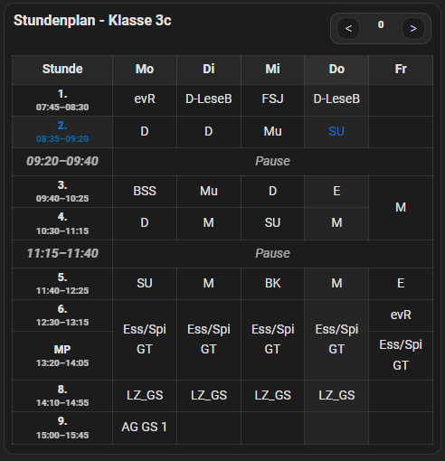
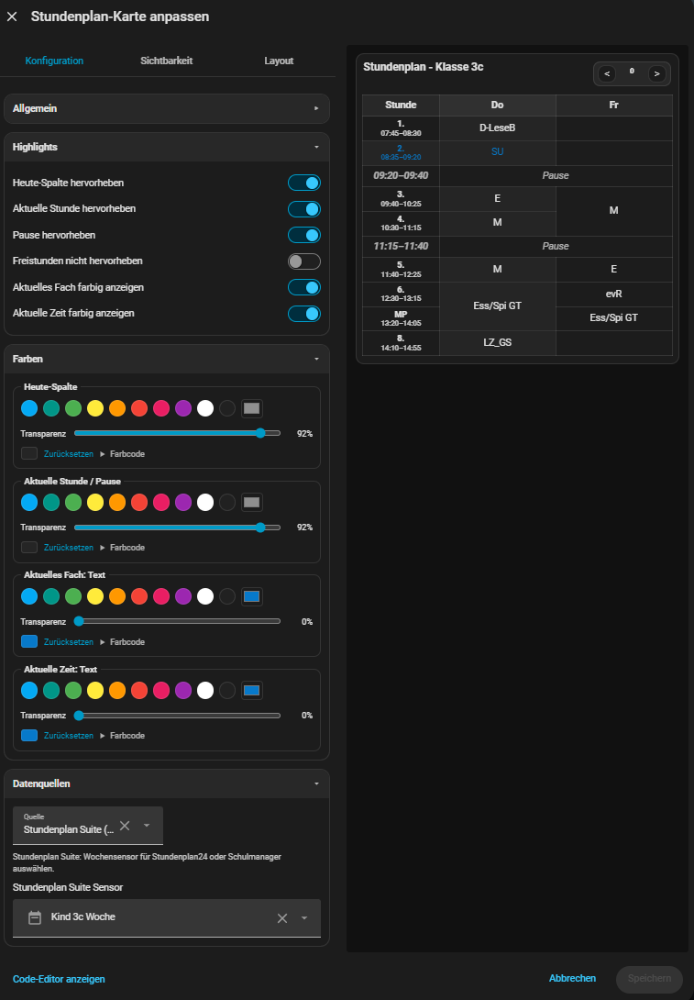

# Stundenplan Card (Home Assistant)

[](https://hacs.xyz)


[](https://www.buymeacoffee.com/fabelsmith)

> **Welche Komponenten brauchst du?**
> - **Manueller Stundenplan oder vorhandener JSON-Sensor:** Die **stundenplan-card** genügt.
> - **Stundenplan24:** **stundenplan-suite** für die Daten und **stundenplan-card** für die Anzeige.
> - **Schulmanager Online:** Vorhandene **Schulmanager-Integration** mit der **stundenplan-suite** verbinden und in der **stundenplan-card** anzeigen.

Eine flexible Stundenplan-Karte für Home Assistant mit **visuellem Editor**,
**A/B-Wochen**, **Wochen- und Rolling-Ansicht** sowie individuellen Farben.
Sie zeigt manuelle Pläne, Daten aus JSON-Sensoren oder Wochensensoren der
Stundenplan Suite an und kann den aktuellen Unterricht hervorheben.

> **Hinweis:**\
> Diese Card ist das **Frontend**.\
> Wenn du deinen Stundenplan automatisch aus *stundenplan24.de* oder aus
> der Home-Assistant-Integration *Schulmanager Online* übernehmen möchtest,
> nutze die
> **stundenplan-suite**:\
> https://github.com/fabel-smith/stundenplan-suite

------------------------------------------------------------------------

## ✨ Features

-   Tabellenansicht (Tage × Stunden)
-   Ganze Woche oder **Ab heute (rolling)**, optional auf die Kalenderwoche begrenzt
-   Normale und kompakte Darstellung
-   Optionale Schriftgrößen und Mindesthöhe der Stundenzeilen unter **Schrift & Abstände**
-   Titelzeile, Datum und Zeitspalte optional ausblendbar
-   Ansicht umschalten oder Wochen-Popup per Tipp auf die Karte
-   Gleiche Folgestunden verbinden und leere Endstunden ausblenden (optional)
-   Fächer/Angebote pro Karte gezielt ausblenden, etwa Essen, Betreuung oder AGs (optional)
-   Gleichmäßige Tages-Spalten für mehrere gleich breite Karten (optional)
-   **Kompletter visueller Editor (kein YAML notwendig)**
-   Manueller Stundenplan direkt im Dialog bearbeitbar
-   Aufklappbare Stunden (Accordion-Editor)
-   Fächer je Wochentag editierbar
-   Fach kann um Lehrer und Raum ergänzt werden
-   Mehrere Einträge pro Stunde möglich (Zellen teilbar / Leerzeile)
-   Kompletter Stundenplan direkt im UI pflegbar
-   Pausen-Zeilen (`break: true` + `label`)
-   Farbpalette, freier Farbwähler und Transparenzregler für Highlights und manuelle Zellen
-   Optionale transparente Hintergründe und Trennlinien unter **Hintergründe & Linien**, auch per CSS-Variablen
-   Hintergrund- und Textfarben pro Fachzelle; JSON-/Sensorquellen unterstützen `cell_styles`
-   Heute-Highlight (`highlight_today`)
-   Aktuelles Fach hervorheben (`highlight_current`)
-   Stunden untereinander einfügen / Pausen darunter einfügen
-   Zeilen löschen
-   A/B-Wochen
-   HACS-kompatibel

------------------------------------------------------------------------

## 📸 Screenshots

Beispiele mit vollständig erfundenen Stundenplänen, Räumen und Lehrkräften.
Die Bilder werden mit der echten Karte in einer lokalen Browser-Testumgebung
erzeugt. Home-Assistant-Bedienelemente sind dort vereinfacht nachgebildet.

### Wochenansicht

[](docs/screenshots/week.png)

Alle Schultage im Überblick, mit Pausen, verbundenen Folgestunden und
Hervorhebung des aktuellen Unterrichts.

### Ab heute (rolling) und Farbeinstellungen

Highlights, Farbpalette und Transparenz lassen sich direkt im visuellen Editor
einstellen. Die Vorschau zeigt Donnerstag und Freitag mit Raum- und
Lehrerangaben, verbundenen Folgestunden und ausgeblendeten leeren Endstunden.
Die gezeigten Daten sind keine echten Schulmanager- oder Kinderdaten.

[](docs/screenshots/editor.png)

### Neuer visueller Editor (manueller Stundenplan)

Der Stundenplan kann vollständig direkt im Home-Assistant-Dialog
erstellt werden ---\
kein YAML und keine JSON-Dateien notwendig.

-   Stunde anklicken → Details bearbeiten
-   Fach pro Wochentag eintragen
-   Lehrer und Raum optional ergänzen
-   Farben individuell setzen
-   Pausen als eigene Zeile definieren

------------------------------------------------------------------------

## 🧩 Installation

### Installation über HACS (empfohlen)

Die Karte ist derzeit als **benutzerdefiniertes Repository** verfügbar;
eine Aufnahme in den HACS-Standardkatalog ist noch nicht erfolgt.

1. HACS öffnen und im Drei-Punkte-Menü **Benutzerdefinierte Repositories** wählen.
2. `https://github.com/fabel-smith/stundenplan-card` eintragen und als Typ **Dashboard** auswählen.
3. **Stundenplan Card** in HACS suchen und herunterladen.
4. Home Assistant im Browser neu laden (bei Bedarf den Browser-Cache aktualisieren).

Die Lovelace-Resource wird in der Regel automatisch hinzugefügt.

### Manuelle Prüfung der Resource (nur falls nötig)

Einstellungen → Dashboards → Ressourcen

URL:

    /hacsfiles/stundenplan-card/stundenplan-card.js

Typ:

    JavaScript-Modul

> **Hinweis (Browser-Cache):**\
> Nach einem Update der Card kann es notwendig sein den Browser-Cache zu
> leeren (`STRG + F5`), da Home Assistant Custom Cards aggressiv cached.

------------------------------------------------------------------------

## 🔁 Wechselwochen (A/B)

Die Card unterstützt Schulen mit **A/B-Wochenmodell**.

Empfohlener Standardfall: - Umschaltung rein nach Kalenderwoche (gerade
/ ungerade KW) - keine Ferienlogik erforderlich

------------------------------------------------------------------------

## 🧑‍🏫 Manueller Stundenplan (ohne Sensoren, ohne JSON)

Du kannst den Stundenplan komplett direkt in der Card pflegen.

Vorgehen:

1.  Card zum Dashboard hinzufügen
2.  Bearbeiten öffnen
3.  Unter **Datenquellen** die Quelle **Manuell (rows)** auswählen
4.  Den nun sichtbaren Abschnitt **Manueller Stundenplan** aufklappen
5.  **+ Stunde** oder **+ Pause** hinzufügen
6.  Stunde anklicken → Details bearbeiten

Ein Klick auf eine Fachzelle in der Vorschau öffnet die passende Zeile und
fokussiert das Fach im manuellen Editor. Bei verbundenen Folgestunden entscheidet
die angeklickte Zeilenposition; bei Rolling über eine A/B-Wochengrenze wird der
passende Wochenplan geöffnet. Die Tap-Aktion der Karte ist im Bearbeitungsdialog
deaktiviert, auf dem Dashboard bleibt sie unverändert aktiv.

Für diesen manuellen Modus brauchst du weder eine externe Integration noch
JSON-Dateien oder REST-Sensoren. Auch manuelle A/B-Pläne sind ohne Suite möglich.

### Einstellbar pro Stunde

-   Fachbezeichnung
-   Lehrer (optional)
-   Raum (optional)
-   Start- und Endzeit
-   Fach pro Wochentag (Mo--Fr)
-   Pause (colspan-Zeile)
-   Hintergrundfarbe je Fach
-   Transparenz
-   Textfarbe

Mit **„+ Stunde darunter"** oder **„+ Pause darunter"** kannst du den
Plan sehr schnell aufbauen.

### Manuelle Wechselwochen

Im Abschnitt **Manueller Stundenplan** kannst du **Wechselwochen A/B**
aktivieren. Anschließend lassen sich Woche A und Woche B getrennt im
visuellen Editor pflegen. Die Karte wechselt automatisch anhand der
Kalenderwoche. Dabei kannst du festlegen, ob Woche A auf eine gerade oder
ungerade Kalenderwoche fällt.

Im YAML entsprechen dem die Einstellungen:

```yaml
source_type: manual
week_mode: kw_parity
week_a_is_even_kw: true
rows:       # Woche A
  - time: 1.
    cells: [Mathe, Deutsch, Englisch, Sport, Biologie]
rows_b:     # Woche B
  - time: 1.
    cells: [Deutsch, Mathe, Kunst, Englisch, Sport]
```

## Anzeigeoptionen

Diese Optionen gelten unabhängig davon, ob die Daten manuell, aus einem
JSON-Sensor oder aus der Suite kommen.

### Zeitspalte ausblenden

Für Essenspläne und andere Wochenübersichten kann die Spalte
**„Stunde"** im Bereich **„Allgemein"** deaktiviert werden. Im YAML:

```yaml
show_time_column: false
```

### Leere Endstunden ausblenden

Unter **Allgemein → Ansicht** kann die Karte automatisch nach der letzten
belegten Stunde der aktuell sichtbaren Tage gekürzt werden. In YAML:

```yaml
trim_empty_rows: true
```

Die Einstellung entfernt nur vollständig leere Zeilen am Tabellenende. Pausen
und Freistunden zwischen belegten Stunden bleiben erhalten. In der
rollierenden Ansicht werden ausschließlich die gerade sichtbaren Tage
berücksichtigt.

### Doppelstunden verbinden

Unter **Allgemein → Ansicht** können direkt aufeinanderfolgende identische
Fächer automatisch zu einer gemeinsamen Zelle verbunden werden. In YAML:

```yaml
merge_double_lessons: true
```

Die Karte verbindet nur nicht-leere Zellen mit demselben Text und demselben
Zellstil. Pausenzeilen unterbrechen die Verbindung. Dadurch bleiben echte
Freistunden erhalten, und Ausfälle oder Änderungen werden nicht versehentlich
mit regulären Stunden zusammengefasst. Die Markierung der aktuellen Stunde gilt
für den gesamten verbundenen Zeitraum.

Unterschiede, die bei der Darstellung keine Wirkung haben (beispielsweise eine
Transparenzangabe ohne Hintergrundfarbe), verhindern die Verbindung nicht.

### Gleichmäßige Spaltenbreiten


Für mehrere gleich breite Stundenplan-Karten mit gleicher Anzahl sichtbarer
Tage kann unter
**Allgemein → Ansicht** die Option **Gleichmäßige Spaltenbreiten** aktiviert
werden. In YAML:

```yaml
equal_column_widths: true
```

Dann werden die Tages-Spalten gleichmäßig auf die verfügbare Kartenbreite
verteilt und lange Fachbezeichnungen innerhalb ihrer Spalte umgebrochen. Das
funktioniert sowohl mit der ganzen Woche als auch mit einer eintägigen
Rolling-Ansicht. Ohne diese Option bestimmt der Inhalt wie bisher die Breite.

### Transparente Hintergründe

Im visuellen Editor unter **Hintergründe & Linien** lassen sich Kartenfläche,
Tabellenkopf und Navigation, Zeilenzellen sowie Trennlinien unabhängig einstellen.
Alle Felder bieten Farbpalette, freie Farbwahl und Transparenzregler.
**100 % Transparenz** macht die jeweilige Fläche vollständig durchsichtig.

Beispiel für ein Dashboard mit Hintergrundbild (zusätzlich zur bisherigen Konfiguration):

```yaml
card_background: transparent
header_background: transparent
row_background: transparent
divider_color: "rgba(255, 255, 255, 0.15)"
```

Für eine leicht getönte Kartenfläche kann beispielsweise
`card_background: "rgba(20, 25, 30, 0.35)"` verwendet werden.
Unterstützt werden auch Hex-Farben, Hex-Farben mit Alpha und CSS-Farbvariablen.
Die Transparenz betrifft nur die Flächen, nicht die Lesbarkeit des gesamten Karteninhalts.

| YAML-Option | CSS-Variable am Element `stundenplan-card` |
| --- | --- |
| `card_background` | `--stundenplan-card-background` |
| `header_background` | `--stundenplan-header-background` |
| `row_background` | `--stundenplan-row-background` |
| `divider_color` | `--stundenplan-divider-color` |

Explizite Kartenoptionen haben Vorrang vor geerbten CSS-Variablen.
**Zurücksetzen** entfernt die jeweilige Option. Ohne Vorgaben bleiben die bisherigen
Theme-Farben erhalten; Zeilenzellen sind standardmäßig transparent zur Kartenfläche.
Die Kartenfläche berücksichtigt weiterhin `--ha-card-background` beziehungsweise
`--card-background-color`, der Tabellenkopf `--secondary-background-color`.

Die Optionen gelten für alle Datenquellen und das Wochen-Popup.
Individuelle Zellfarben und Zellrahmen haben Vorrang. Heute-/Stunden-Highlights
sowie Hinweisfarben bleiben unabhängig davon erhalten und können weiterhin
über ihre bisherigen Einstellungen angepasst werden. Der abgedunkelte Bereich
hinter dem Wochen-Popup bleibt unverändert.

### Editor und Fächer/Angebote filtern

Die aufklappbaren Editorbereiche haben Icons und kurze Erklärungen. Nach
**Allgemein** folgt **Datenquellen**, danach bei manueller Quelle der
**Manuelle Stundenplan**. Unter **Inhalte filtern** wählst du anschließend
die Fächer/Angebote aus, die auf dieser Karte nicht angezeigt werden sollen.
Danach folgen Rolling, Schrift & Abstände, Highlights, Farben sowie
Hintergründe & Linien. Die Bereiche sind auch per Tastatur bedienbar.

[Editorübersicht](docs/screenshots/editor-overview.png) und
[Beispiel mit ausgeblendeten Fächern/Angeboten](docs/screenshots/filtered-offers.png)
zeigen die neuen Bereiche mit fiktiven Daten.

**Inhalte filtern** schlägt Fachnamen aus der aktuell verfügbaren Quelle vor.
Angehakte Namen werden ausgeblendet. Fehlende Namen kannst du einzeln über
**Fächer/Angebote ergänzen** hinzufügen. Bei einer direkten JSON-URL werden
keine zusätzlichen Daten im Editor abgerufen; ergänze dort die Namen selbst.
Bereits gewählte Namen bleiben auch dann editierbar, wenn sie gerade nicht
in der Quelle stehen. Ein Quellwechsel löscht die Filter nicht.

Beispiel für ein Kind ohne Nachmittagsbetreuung:

```yaml
hidden_subjects:
  - Ess/Spi GT
  - LZ_GS
  - AG GS 1
```

Verglichen wird der **vollständige Fachname in der ersten Zeile** eines
Eintrags. Groß-/Kleinschreibung und mehrfache Leerzeichen spielen keine Rolle;
Teiltreffer, Lehrer, Räume und Hinweise werden nicht durchsucht. Bei mehreren
durch Leerzeilen getrennten Einträgen in einer Zelle wird jeder einzeln
geprüft. Neue oder geänderte Fachnamen werden nicht automatisch ausgeblendet.

Bei aktivem Filter werden vollständig leere **Endzeilen** automatisch gekürzt,
auch ohne zusätzliche Einstellung „Leere Endstunden ausblenden“. Pausen und
Lücken zwischen verbleibenden Stunden bleiben erhalten. In der Wochenansicht
bleibt beispielsweise die 6. Zeile sichtbar, wenn am Freitag noch regulärer
Unterricht stattfindet; die ausgeblendeten Einträge anderer Tage sind leer.
Ist alles ausgeblendet, erscheint „Keine Einträge nach Filterung“.

Rolling mit **Nach der letzten Stunde** verwendet bei aktivem Filter die
letzte verbleibende Endzeit **des jeweiligen Tages**, inklusive A/B-Woche und
zellbezogener Zeiten. Bei fehlender Endzeit oder einem vollständig leeren Tag
wird nicht vorzeitig weitergeschaltet. Ohne Filter bleibt das bisherige
Verhalten erhalten. Es gibt keine feste Grenze bei einer bestimmten Stunde.

Der Filter gilt für alle Datenquellen und das Wochen-Popup, nur innerhalb
dieser Karte. Die Quelldaten und andere Karten bleiben unverändert. Mit
**Alle Einträge wieder anzeigen** lässt er sich vollständig zurücksetzen.
Standardmäßig ist nichts ausgeblendet. Bitte wähle nur Fächer/Angebote aus,
die für das Kind tatsächlich nicht relevant sind.

### Rolling auf eine Kalenderwoche begrenzen

Die Auswahl **Ab heute (rolling)** bleibt unter **Allgemein → Ansichtsmodus**.
Danach erscheint das eigene, zunächst geschlossene
Akkordeon **Rolling**. Dort findest du die zusätzlichen Tage, den Tageswechsel,
die feste Umschaltzeit und optional **Auf Kalenderwoche begrenzen**.
Beim Wechsel zur Wochenansicht wird der Abschnitt ausgeblendet; gespeicherte
Rolling-Einstellungen bleiben erhalten.

```yaml
view_mode: rolling
days_ahead: 4
rolling_week_only: true
```

Ab Donnerstag erscheinen bei Schultagen Mo–Fr nur Donnerstag und Freitag.
Die Grenze ist der Sonntag der Woche des Starttags. Am Wochenende springt die
Ansicht wie bisher zum nächsten konfigurierten Schultag (normalerweise Montag).
Auch die eingestellte Umschaltzeit bleibt wirksam: Nach der letzten Stunde am
Freitag kann Montag bereits der neue Starttag sein. Die Option ist standardmäßig
aus; bestehende Rolling-Ansichten bleiben wochenübergreifend.

### Editor und Farben

Der Editor passt seine Felder an die verfügbare Breite an. Ansichtsmodus,
Ansichtsdichte und Tap-Aktion werden über kompakte Dropdowns ausgewählt.
Der Bereich **Manueller Stundenplan** erscheint nur bei der Datenquelle
**Manuell**. Gespeicherte A/B-Pläne bleiben bei einem Quellenwechsel erhalten.

Unter **Farben** und bei manuellen Zellen stehen eine Farbpalette, ein freier
Farbwähler und ein Transparenzregler bereit: **0 % = deckend, 100 % = durchsichtig**.
Bestehende Farbwerte werden beim Öffnen nicht verändert. Individuelle CSS-Werte
können weiterhin unter **Farbcode** eingetragen werden. Die Schalter für farbige
Fach- und Zeittexte befinden sich unter **Highlights**.

### Schrift & Abstände

Unter **Allgemein → Titel & Kopfzeile → Wochennavigation anzeigen** kannst du
die Pfeile mit dem Wochenversatz oben rechts ausblenden. Datenquelle und
ausgewählter Wochenversatz bleiben dabei erhalten; eine A/B-Wochenanzeige
ist davon unabhängig. Ohne neue Einstellung bleibt die Navigation sichtbar,
sofern die gewählte Quelle sie unterstützt.

Unter **Schrift & Abstände → Abstand Kopfzeile / Tabelle (px)** kannst du den
zusätzlichen Abstand unterhalb von Titel und Navigation festlegen (0–64 px).
Leer lässt den bisherigen Abstand unverändert; `0` entfernt den zusätzlichen
Zwischenraum. Ist die gesamte Kopfzeile ausgeblendet, wird kein leerer Platz
reserviert. Die Einstellung gilt auch im Wochen-Popup.

```yaml
show_week_navigation: false
header_table_gap: 4
```

Im aufklappbaren Bereich **Schrift & Abstände** kannst du Fachtext, Stunden und
Uhrzeiten, Wochentage sowie Raum-, Lehrer- und Hinweistext vergrößern.
Die Einstellungen gelten für alle Datenquellen, für die normale und kompakte
Ansicht sowie für das Wochen-Popup.

**Leere Felder verwenden die bisherigen Standardgrößen.** Damit sehen bestehende
Karten ohne neue Einstellungen weiterhin gleich aus. Die Mindesthöhe gilt je
Stundenzeile, auch bei verbundenen Folgestunden. Längere Inhalte vergrößern die
Zeile bei Bedarf; Pausenzeilen erhalten diese Mindesthöhe nicht.

Titelgröße und Titel-Schriftfamilie stehen ebenfalls in diesem Bereich.
Die bisherige Titelgröße gilt für die normale Ansicht und das Wochen-Popup;
für die Kompaktansicht gibt es einen eigenen optionalen Wert (Standard: 16 px).
**Größen zurücksetzen** entfernt die neuen Größenangaben und setzt die normale
Titelgröße auf 20 px zurück. Farben und Titel-Schriftfamilie bleiben erhalten.

<details>
<summary>YAML und CSS-Variablen</summary>

Optional zur bestehenden Kartenkonfiguration ergänzen (Zahlen in Pixeln):

```yaml
font_size_subject: 24
font_size_time: 18
font_size_header: 20
font_size_details: 16
row_height: 72
font_size_title_compact: 24
```

Die neuen Schriftgrößen erlauben 8–64 px, die Mindesthöhe 24–240 px.
Entferne einen Schlüssel oder leere sein Editorfeld, um den Standard zu verwenden.

Alternativ können folgende CSS-Variablen an die Karte vererbt werden. CSS-Werte
benötigen eine Einheit, beispielsweise `24px` oder `1.5rem`:

| Einstellung | CSS-Variable |
| --- | --- |
| `font_size_subject` | `--stundenplan-font-size-subject` |
| `font_size_time` | `--stundenplan-font-size-time` |
| `font_size_header` | `--stundenplan-font-size-header` |
| `font_size_details` | `--stundenplan-font-size-details` |
| `row_height` | `--stundenplan-row-height` |
| `font_size_title_compact` | `--stundenplan-font-size-title-compact` |

Explizite Größen in der Kartenkonfiguration haben Vorrang vor geerbten
CSS-Variablen. Nach dem Leeren eines Feldes greift eine vorhandene CSS-Variable
wieder; sonst gilt der Standard der jeweiligen Ansicht.

</details>

Mehrere Fächer innerhalb einer Stunde sind möglich (z. B.
Gruppenunterricht / AG / Teilung).\
Durch eine Leerzeile kann eine Stunde mehrfach unterteilt werden.

### Unterschiedliche Unterrichtszeiten je Tag

JSON- und Sensorquellen können optional für jede Tageszelle eine eigene Zeit
über `cell_times` bereitstellen. Das ist beispielsweise für verkürzte
Unterrichtstage geeignet. Jeder Eintrag darf ein Zeitbereich als Text oder ein
Objekt mit `time`, `start` und `end` sein:

```yaml
time: 08:00-08:45
cells: [Mathe, Englisch]
cell_times:
  - start: "08:00"
    end: "08:45"
  - "08:00-08:30"
```

In der Wochenansicht verwendet die gemeinsame Stunden-Spalte heute als
Fokustag, andernfalls den ersten sichtbaren Tag. In der rollierenden Ansicht
gilt der erste sichtbare Tag. Die Hervorhebung der aktuellen Stunde
berücksichtigt dabei ebenfalls die jeweilige Zellzeit.

------------------------------------------------------------------------

## 🔌 Nutzung mit der stundenplan-suite

Die Card dient sowohl als Anzeige für automatisch importierte Daten
(*stundenplan-suite*) als auch als vollständig eigenständig gepflegter
Stundenplan.

Die Suite unterstützt zwei Datenquellen:

- **Stundenplan24** wird direkt von der Suite abgerufen.
- **Schulmanager Online** wird über die bereits installierte
  [Schulmanager-Integration](https://github.com/rwunsch/schulmanager-online-hass)
  angebunden. Die Suite liest deren Kalender- und Stundenplan-Entitäten und
  erzeugt daraus den einheitlichen Wochensensor für die Karte.

In der Kartenkonfiguration unter **Datenquellen → Stundenplan Suite
(Integration)** einfach den passenden `*_woche`-Sensor auswählen. Die Karte
benötigt keine Schulmanager-Zugangsdaten. Weitere Informationen zur Einrichtung
stehen im Repository der
[Stundenplan Suite](https://github.com/fabel-smith/stundenplan-suite).

------------------------------------------------------------------------

## ⚠️ Wichtiger Hinweis zu automatischen Datenquellen

Die Nutzung der *stundenplan-suite* bzw. der automatischen
Datenübernahme aus **stundenplan24.de** oder **Schulmanager Online** erfolgt **auf eigene
Verantwortung**.

Diese Anzeige ist kein offizielles System der Schule.\
Sie dient ausschließlich der komfortablen Darstellung.

Für die Richtigkeit, Vollständigkeit oder Aktualität der Daten wird
keine Gewähr übernommen.\
Bitte regelmäßig mit den offiziellen Schulquellen abgleichen und nicht
ausschließlich darauf verlassen, insbesondere bei Vertretungen,
Raumänderungen oder Unterrichtsausfall.

------------------------------------------------------------------------

## Update-Hinweise

**v3.6.0** ergänzt **Hintergründe & Linien** mit optionalen Farben und Transparenz
für Kartenfläche, Tabellenkopf, Zeilenzellen und Trennlinien. Die vier Optionen
sind auch per CSS-Variablen verfügbar. Ohne neue Vorgaben bleiben Darstellung,
Fachfarben und Highlights wie bisher.

**v3.5.1** ergänzt die MIT-Lizenz, Lizenzhinweise für eingebundenen Lit-Code und
die automatische HACS-Validierung. Die HACS-Installationsanleitung wurde berichtigt.
Funktionen und Darstellung bleiben unverändert; die Aufnahme in den Standardkatalog steht noch aus.

**v3.5.0** ergänzt den Bereich **Schrift & Abstände** mit optionalen Schriftgrößen,
Mindesthöhe für Stundenzeilen und CSS-Variablen. Titelgröße und Titel-Schriftfamilie
stehen jetzt ebenfalls dort. Ohne neue Größenangaben bleibt die bisherige Darstellung erhalten.

**v3.4.1** korrigiert die Zellenauswahl per Klick in der manuellen Vorschau.
Im Bearbeitungsdialog öffnet der Klick die passende Zelle statt die Tap-Aktion
auszuführen. Auf dem Dashboard bleiben Ansichtswechsel und Wochen-Popup aktiv.

**v3.4.0** ergänzt einen kompakteren, an die Editorbreite angepassten Dialog,
Farbpalette und Transparenzregler sowie die optionale Rolling-Wochengrenze.
Der manuelle Editor erscheint nur bei manueller Datenquelle; gespeicherte
A/B-Pläne bleiben beim Quellenwechsel erhalten.

Bestehende Einstellungen und Farbwerte bleiben erhalten. Die neue
Wochenbegrenzung ist standardmäßig ausgeschaltet.

Alle Änderungen und Hinweise stehen in den
[GitHub-Releases](https://github.com/fabel-smith/stundenplan-card/releases).

------------------------------------------------------------------------

## Lizenz

Der eigene Code der Stundenplan Card steht unter der [MIT-Lizenz](LICENSE).
Der eingebundene Lit-Code unterliegt weiterhin der BSD-3-Clause-Lizenz;
der vollständige Hinweis steht in [THIRD_PARTY_NOTICES](THIRD_PARTY_NOTICES)
und in der ausgelieferten JavaScript-Datei.

## Unabhängiges Projekt & Datenschutz

Die Stundenplan Card ist ein unabhängiges Community-Projekt, kein offizielles
Produkt von Home Assistant, Indiware/Stundenplan24 oder Schulmanager Online.
Anbieternamen beschreiben kompatible Quellen und keine Partnerschaft.

Die Karte zeigt Daten in deiner Home-Assistant-Oberfläche an. Bei Verwendung
einer JSON-URL ruft dein Browser die konfigurierte Quelle ab. Es gibt keinen
eingebauten Telemetrie-Endpunkt des Projektbetreibers. Nutze nur berechtigte
Datenquellen; die MIT-Lizenz verleiht keine Rechte an fremden Schulplänen.
Prüfe wichtige Änderungen im Zweifel an der Originalquelle.

Bitte verwende in öffentlichen Issues und Screenshots erfundene Beispieldaten.
Keine Zugangsdaten, vollständigen HA-Konfigurationen, echten Namen oder
identifizierbaren Schulpläne veröffentlichen. Auch Lehrer- und Raumkürzel können
mit Zusatzinformationen Personen erkennbar machen. Für Sicherheitsmeldungen
siehe [SECURITY.md](SECURITY.md).

------------------------------------------------------------------------

## ☕ Unterstützung

Wenn dir die Card hilft oder dir Zeit spart, freue ich mich über Unterstützung:

<a href="https://www.buymeacoffee.com/fabelsmith" target="_blank">
  
</a>
